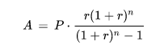

**loan_installments_calculator - documentation.**

This program's purpose is creating the table with payment plan for user's loan based on information such as amount of user's loan, interest rate, bank's commission and user's preferred period of payment (in months). Program calculates amount of every installment based on EMI formula (more information at the end of the documentation).

**How does this program work?**

Firstly, this program takes data about user's loan from the user (date when loan was taken, commision of the bank, interest rate, amount of months user wants to pay their loan in). Then, based on provided data, program calculates amount of every installment using EMI formula (installments aren't equal because of varying WIBOR rate for every month) and once amounts of all installments are calculated, program calculates the average amount of all rates and uses this value as an amount of installment user has to pay every month (our goal was to make all the installments equal). After calculating average amount of all installments (which also is a final amount of every installment), program creates the table where information about all installments amounts and dates of paying these installments are present and displays this table to the user.

**How to use this program?**

If user uses Linux device:

In order to use this program, user has to open terminal, change directory to the location where this program is saved on user's device and type 'python3 loan_installments_calculator.py'. Then, user has to insert all necessary data about their loan. After these steps, table with the payment plan will be displayed. Disclaimer - in order to use this program, user has to download python rich package on their device.

If user uses Windows device:

In order to use this program, user has to open loan_installments_calculator.py file with Python IDE of their choice (for example Visual Studio Code) and run it (for example, you can run the file in Visual Studio Code by pressing a triangle on the top right side of the window). Then, user has to insert all necessary data about their loan. After these steps, table with the payment plan will be displayed. 

Alternatively, user can run this file using Windows Powershell - then, process of running the program is similar to running the program on linux device: user has to change directory to the location where this program is saved on their device and type 'python3 loan_installments_calculator.py' into the terminal. After these steps, user can use this program.

**Description of all program's variables:**

| variable name | description |
| ------------- | ----------- |
| loanAmount | Integer, stores the amount of money borrowed by the user (in PLN). |
| loanCommission | Float number, stores the value of commission of the bank (in %). |
| loanInterestRate| Float number, stores the annual interest rate of user's loan (in %). |
| periodOfPayment | Integer, stores the length of payment period of user's loan (in months). |
| totalLoanAmount | Integer, stores total amount of the loan, including commission of the bank (in PLN). |
| installment | Integer, stores amount of monthly loan installment. |
| paymentPlan | Table, it has two columns (one stores dates of payment of every installment, another one stores amounts of these payments) and every row stores data about one installment payment (date of this payment and amount that has to be paid). |
| months | Dictionary, it's used to translate number of month from integer to string. |
| monthsReversed | Dictionary, it's used to translate number of month from string to integer. |
| days | Dictionary, it's used to translate number of day from integer to string. |
| daysReversed | Dictionary, it's used to translate number of day from string to integer. |
| wiborRates | Dictionary, it stores values of wibor rates for every month (in %). |
| userDate | String, it stores the date when user took the loan. |
| userDay | String, it stores the day when user took the loan. |
| userMonth | String, it stores the month when user took the loan. |
| userYear | String, it stores the year when user took the loan. |

**Description of all program's functions:**

| function name | description |
| ------------- | ----------- |
| takeUserDate | This function takes the date when user took the loan as a string and then gets the number of day, month and year from this string. |
| takeLoanAmount | This function takes amount of user's loan. |
| takeLoanCommission | This function takes amount of bank's commission. |
| takeLoanInterestRate | This function takes interest rate of user's loan. |
| takePeriodOfPayment | This function takes user's preferred period of payment of their loan (in months). |
| calculateTotalLoan | This function alculates total amount of user's loan (including bank commission). |
| calculateInstallment | This function calculates amount of installment, based on loan amount, period of payment, interest rate and wibor rate. |
| calculateAverageInstallment | This function calculates average installment for all months in the period of payment. |
| createTable | This function creates and displays the table with all dates of loan installment payments and amount of installment payments. |

**Formula used to calculate amount of installments:**

The formula i used in this program to calculate amount of installments is called Equated Monthly Installment (EMI)

A - amount of monthly installment

P - total amount of loan (including bank's commission)

r - monthly interest rate + monthly wibor rate (annual interest rate / 12 + annual wibor rate / 12)

n - period of loan payment (in months)

source of the formula: https://en.wikipedia.org/wiki/Equated_monthly_installment
